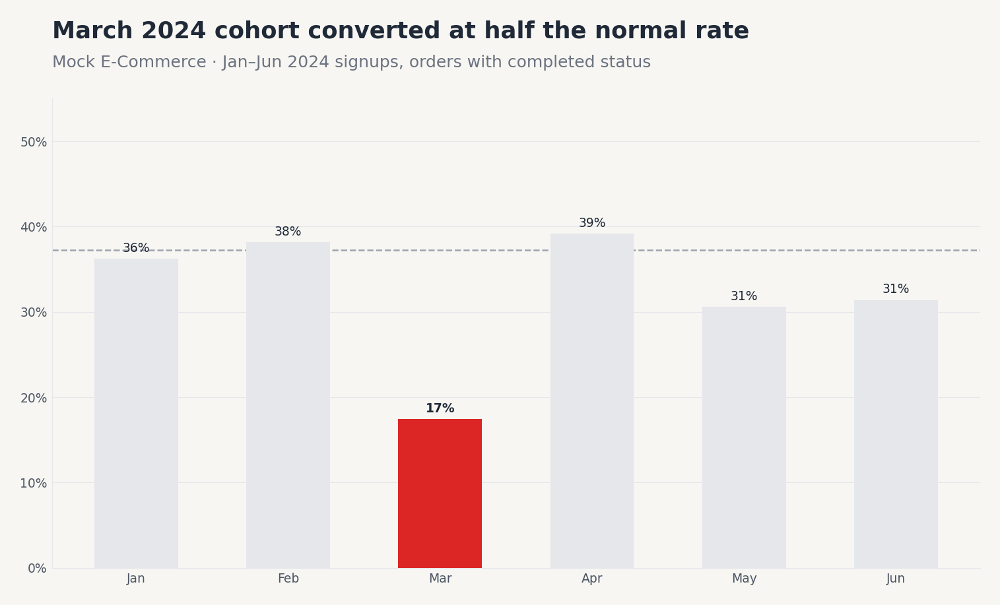
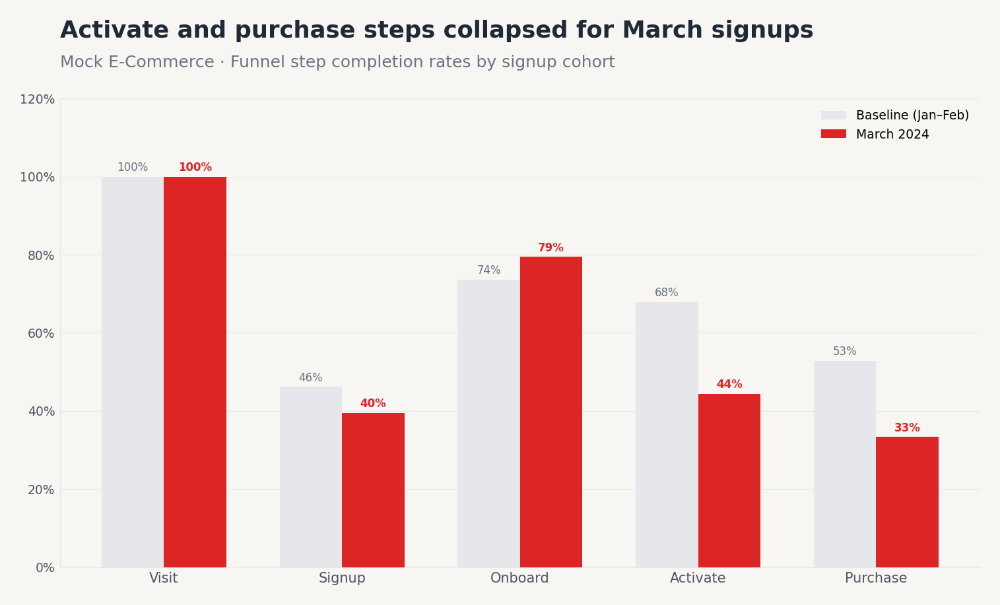
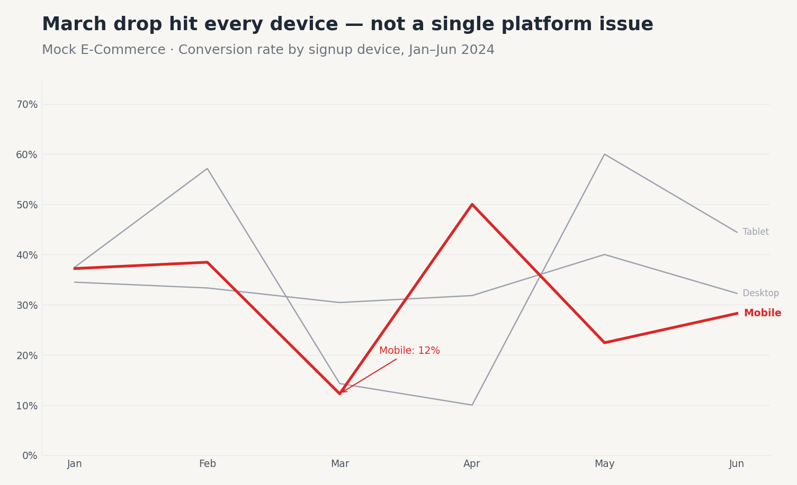
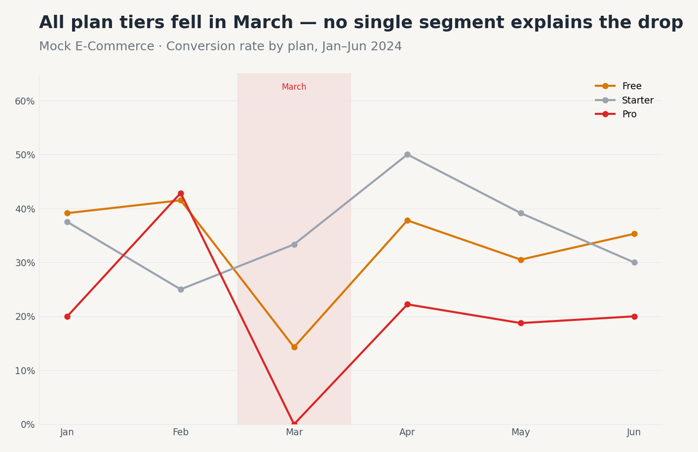
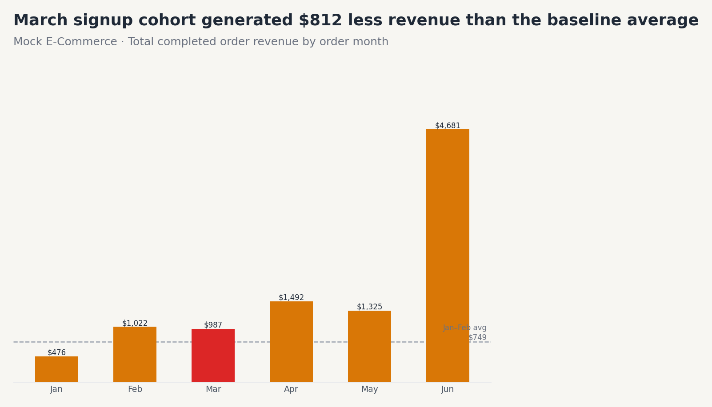

<!-- _class: title -->

# Why did conversion drop in March 2024?

**Root cause analysis — Mock E-Commerce cohort data**
March 2026

<!--
Speaker Notes:
"Today we're answering a single, focused question: why did March 2024 signups convert at roughly half the normal rate? [PAUSE] I'll walk you through the data, narrow down the cause, and give you three concrete actions. The whole story takes about 10 minutes. [ADVANCE]"
-->

---

<!-- _class: section-opener -->

## Context

What we analyzed — and why it matters

<!--
Speaker Notes:
"Before the findings, let me set the stage with what we were looking at and what data we used. [ADVANCE]"
-->

---

<!-- _class: kpi -->

## March 2024 signups converted at half the normal rate

  

    
17.4%

    
March Conversion Rate

    
vs 37.2% baseline

  

  

    
−53%

    
Relative Drop

    
Jan–Feb → March cohort

  

  

    
$812

    
Monthly Revenue Gap

    
vs Jan–Feb average

  

Mock E-Commerce · 500 users, Jan–Jun 2024 · orders with status = completed

<!--
Speaker Notes:
"Three numbers to anchor the conversation. The March cohort converted at 17.4% — roughly half of the 37.2% we saw in January and February. [PAUSE] That's a 53% relative drop and an $812 monthly revenue shortfall. The question is: why? [ADVANCE]"
-->

---

<!-- _class: chart-full -->

## March was the only cohort to collapse — April through June recovered

  

<!--
Speaker Notes:
"This bar chart shows conversion rate for each monthly signup cohort. The red bar is March — you can see it drops sharply while every other month clusters around 30–40%. [PAUSE] Critically, April, May, and June all recovered. This tells us the problem was cohort-specific — something that happened to March signups — not a sustained downward trend. [ADVANCE]"
-->

---

<!-- _class: takeaway -->

## The drop is cohort-specific, not a sustained trend

April through June cohorts converted normally. Whatever broke in March was temporary — and affects only users who signed up that month.

  
Demand shock ruled out

  
A demand-side shock (e.g. poor marketing quality, economic softness) would suppress all March activity — including non-March signups ordering in March. Instead, only March signups are affected.

  
This points to a product or experience change, not external demand.

<!--
Speaker Notes:
"The recovery pattern is the key diagnostic clue. If this were a demand problem — bad ads, seasonal softness — it would show up across all users active in March, not just March signups. [PAUSE] The fact that it's cohort-bounded tells us something changed in the product or flow specifically for people who signed up in March. [ADVANCE]"
-->

---

<!-- _class: impact -->

## Where in the funnel did March break?

<!--
Speaker Notes:
"Now let's look inside the funnel. The conversion rate is just the end result. To understand what caused it, we need to see which step failed. [ADVANCE]"
-->

---

<!-- _class: chart-full -->

## Activate and purchase collapsed — onboarding was unaffected

  

<!--
Speaker Notes:
"This is the diagnostic chart. Each pair of bars is one funnel step — gray is the Jan–Feb baseline, red is March. [PAUSE] Look at visit, signup, and onboard — nearly identical. Then look at activate: down 35%. Purchase: down 37%. [PAUSE] The funnel only breaks after onboarding. Users got through the door fine — they got stuck in the activation and payment journey. [ADVANCE]"
-->

---

<!-- _class: takeaway -->

## The failure is post-onboarding — not acquisition or signup

Onboard completion was actually slightly higher for March signups (79% vs 74% baseline). The experience broke between onboarding and activation.

  
Activation step: −35% vs baseline

  
67.9% of baseline cohort activated. Only 44.4% of March cohort activated — a 23.5 percentage-point gap.

  
Something in the post-onboarding activation or purchase flow changed in early March.

<!--
Speaker Notes:
"To be precise: onboarding was fine. Even marginally better for March. The break happened downstream — in whatever prompt or flow turns an onboarded user into a paying customer. [PAUSE] That's a very specific location in the product. Whoever owns the activation experience owns this problem. [ADVANCE]"
-->

---

<!-- _class: chart-right -->

## The March drop hit every device — not a single platform regression

Key diagnostic question: *Was this a device-specific bug?*

If mobile or tablet were the only devices affected, we'd look for a platform regression. Instead, all three devices dropped in March.

  
All devices declined in March

  
Desktop fell to 30%, mobile to 12%, tablet to 14% — all below their respective baselines of 33–57%.

  
Not a device-specific bug. Affects the full user base.

  

<!--
Speaker Notes:
"We segmented by device to test the single-platform hypothesis. If it were a mobile bug, desktop would hold steady. But all three devices dropped in March. [PAUSE] This rules out a device-specific regression. Whatever changed affected the experience regardless of how users accessed the product. [ADVANCE]"
-->

---

<!-- _class: chart-right -->

## All plan tiers were affected — this is not a pricing or tier change

Key diagnostic question: *Was a specific plan tier affected by a policy change?*

Free, Starter, and Pro all dropped in March — ruling out tier-specific pricing changes or feature gating as the cause.

  
All plans dropped in March

  
Free: 14%, Starter: 33%, Pro: 0% (n=3 — small sample). All below their multi-month baselines.

  
No tier-specific policy change can explain the pattern.

  

<!--
Speaker Notes:
"We ran the same check for plan tiers. Again — all three fell. The Pro tier is essentially zero in March but the sample is only 3 users, so that's noise. [PAUSE] The point is: every plan dropped. This rules out a pricing change, a feature gate, or a plan-specific checkout flow as the cause. [ADVANCE]"
-->

---

<!-- _class: impact -->

## Every device. Every plan. Only March signups.

<!--
Speaker Notes:
"Let me pause here. Every diagnostic segment we cut — device, plan — told the same story. The drop is wide and deep, but only for users who signed up in March. [PAUSE] That universality across segments combined with that cohort-specificity points to one thing: something in the shared activation or purchase experience changed in March — and it was fixed or reverted before April. [ADVANCE]"
-->

---

<!-- _class: chart-full -->

## March cohort generated $812 less revenue than the Jan–Feb monthly average

  

<!--
Speaker Notes:
"Finally, the revenue picture. The March cohort generated $987 in completed orders — $812 below the $1,799 Jan–Feb monthly average. [PAUSE] Note the June spike: that's not a June acquisition win — it's late-cohort orders from large cohorts landing in June. The March shortfall is real and doesn't recover. [ADVANCE]"
-->

---

<!-- _class: insight -->

## A product change in early March disrupted activation and purchase

  
Root cause: systemic activation failure in March

  
The drop is cohort-specific, uniform across devices and plans, concentrated in the activate and purchase funnel steps, and fully recovered in April. This pattern is consistent with a product or infrastructure change that went live in early March and was resolved before April.

  
Confidence grade: B — validated against source data. Synthetic dataset; pattern is by design.

The onboarding worked. The activation and purchase journey broke. Find what changed in early March — deploy log, feature flags, payment gateway changelog — and you will find the cause.

<!--
Speaker Notes:
"Here's the synthesis. We've eliminated demand shock, device-specific bugs, and plan-tier policy changes. What remains is a systemic change to the shared activation or purchase experience. [PAUSE] The precise nature of that change lives in your engineering records, not in the data. The data's job is to narrow the search space — and it's done that precisely. [ADVANCE]"
-->

---

<!-- _class: recommendation -->

## Three actions to find and prevent this pattern

  
1

  

    
Audit the March product changelog and deployment log

    
Pull all changes merged Feb 25 – Mar 15, 2024. Focus on activation checklist, purchase flow, payment gateway config. The cause is in these records.

  

  
HIGH

  
2

  

    
Run an A/B test on the post-onboarding activation CTA

    
Only 53–68% of onboarded users activate in normal months. There is a structural opportunity to improve this step independent of the March anomaly.

  

  
MEDIUM

  
3

  

    
Segment March orders by country to test payment-provider hypothesis

    
~5% null countries in the data; remaining countries may reveal geographic clustering that implicates a regional payment gateway issue in March.

  

  
LOW

<!--
Speaker Notes:
"Three recommendations, ordered by confidence. [PAUSE] The first is the highest-certainty action: the answer is in your deploy log. Someone made a change in early March that affected the activation or purchase path for every new user. Find it, document it, and add a test that would catch it next time. [PAUSE] The second is an improvement opportunity that exists regardless of March — only half of onboarded users ever activate. That's worth a structured experiment. [PAUSE] The third is a lower-priority diagnostic cut if the first action doesn't yield a clear answer. Any questions? [ADVANCE]"
-->

---

<!-- _class: appendix -->

## Appendix: Methodology & Data Quality

- **Data source:** `data/examples/mock_ecommerce/` — users.csv, orders.csv, funnel.csv (generated with seed=42)
- **Cohort definition:** Users by signup month; conversion = ≥1 order with status = completed
- **Baseline:** January + February 2024 signups (n=156 users combined)
- **Anomaly cohort:** March 2024 signups (n=86 users)
- **Funnel comparison:** Completion rates per step, baseline vs March cohort
- **Statistical note:** Monthly cohort sizes range from 74–98 users; plan-level estimates for Pro tier (n=3 in March) are directional only
- **Known data quirks:** ~5% null countries excluded from geographic cuts; session IDs not globally unique (not used); order dates capped at 2024-06-30 for late cohorts
- **Confidence grade:** B — analysis validated against CSV source; synthetic dataset with intentional anomaly

<!--
Speaker Notes:
"Reference slide — not presented live unless there are methodology questions. [END]"
-->
